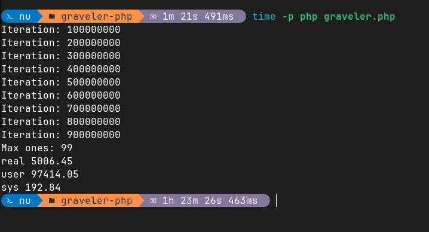

# Graveler PHP
Simulates the likeleyhood of escaping Pikasprey's Graveler soft lock.
It is a multi-threaded PHP implementation of the original Python script by [ShoddyCast](https://www.youtube.com/watch?v=M8C8dHQE2Ro).

## Usage
```bash
php graveler.php
```

By default this library uses 20 threads. You can change this by setting the `TASKMASTER_WORKER_COUNT` environment variable.
For best performance, set this to the number of CPU cores you have and make sure that the `pcntl` PHP extension is installed.
```bash
TASKMASTER_WORKER_COUNT=32 php graveler.php
```

On my laptop running a i9-12900HK CPU the script takes approximately 1.5 hours to complete:
